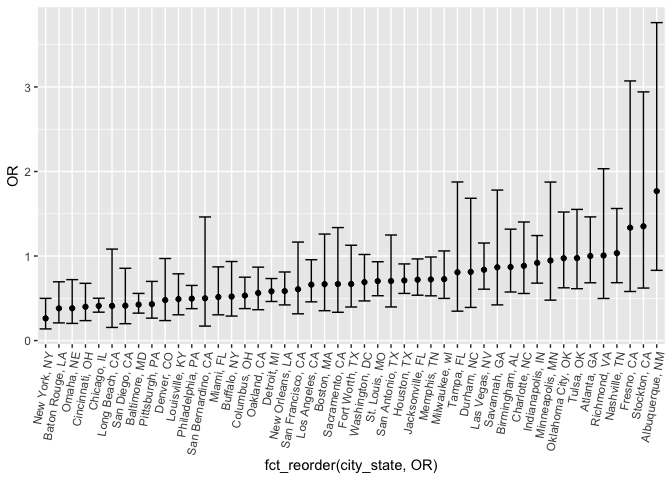
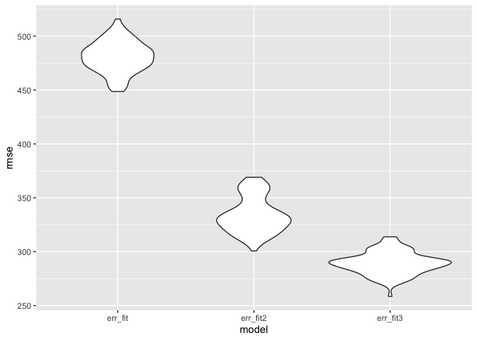

p8105_hw6_kac2301
================
Kate Colvin

## Problem 1

Downloading 2017 Central Park weather data:

``` r
weather_df <- 
  rnoaa::meteo_pull_monitors(
    c("USW00094728"),
    var = c("PRCP", "TMIN", "TMAX"), 
    date_min = "2017-01-01",
    date_max = "2017-12-31") %>%
  mutate(
    name = recode(id, USW00094728 = "CentralPark_NY"),
    tmin = tmin / 10,
    tmax = tmax / 10) %>%
  select(name, id, everything())
```

    ## using cached file: /Users/kac2301/Library/Caches/org.R-project.R/R/rnoaa/noaa_ghcnd/USW00094728.dly

    ## date created (size, mb): 2024-11-20 10:38:25.315627 (8.667)

    ## file min/max dates: 1869-01-01 / 2024-11-30

``` r
boot_sample = function(df) {
  sample_frac(df, replace = TRUE)
}
```

## Problem 2

Reading in and cleaning the data:

``` r
homicide_df <- read_csv("data/homicide-data.csv") %>% 
  unite(city_state, city, state, sep = ", ") %>% 
  mutate(victim_age = na_if(victim_age, "Unknown"),
         victim_age = as.numeric(victim_age),
         victim_sex = na_if(victim_sex, "Unknown"),
         resolved = as.numeric(disposition == "Closed by arrest")) %>% 
  filter(!city_state %in% c("Dallas, TX", "Phoenix, AZ", "Kansas City, MO", "Tulsa, AL")) %>% 
  filter(victim_race %in% c("White", "Black"))
```

    ## Rows: 52179 Columns: 12
    ## ── Column specification ────────────────────────────────────────────────────────
    ## Delimiter: ","
    ## chr (9): uid, victim_last, victim_first, victim_race, victim_age, victim_sex...
    ## dbl (3): reported_date, lat, lon
    ## 
    ## ℹ Use `spec()` to retrieve the full column specification for this data.
    ## ℹ Specify the column types or set `show_col_types = FALSE` to quiet this message.

GLM for Baltimore, MD:

``` r
baltimore_df <- homicide_df %>% filter(city_state == "Baltimore, MD")

balt_glm <- baltimore_df %>% 
  glm(resolved ~ victim_age + victim_sex + victim_race, data =., family = binomial()) 

balt_glm %>%  
  broom::tidy() %>% 
  mutate(OR = exp(estimate)) %>% 
  select(term, log_OR = estimate, OR, std.error, p.value) %>% 
  mutate(OR_lower_ci = exp(log_OR - 1.96*std.error), 
         OR_upper_ci = exp(log_OR + 1.96*std.error))
```

    ## # A tibble: 4 × 7
    ##   term               log_OR    OR std.error  p.value OR_lower_ci OR_upper_ci
    ##   <chr>               <dbl> <dbl>     <dbl>    <dbl>       <dbl>       <dbl>
    ## 1 (Intercept)       0.310   1.36    0.171   7.04e- 2       0.975       1.91 
    ## 2 victim_age       -0.00673 0.993   0.00332 4.30e- 2       0.987       1.00 
    ## 3 victim_sexMale   -0.854   0.426   0.138   6.26e-10       0.325       0.558
    ## 4 victim_raceWhite  0.842   2.32    0.175   1.45e- 6       1.65        3.27

The estimate of the odds ratio for solving homicides comparing male
victims to female victims is 0.426 \[0.325, 0.558\].

Running glm for each of the cities, extracting estimates for
victim_sexMale:

``` r
cities_list <- unique(homicide_df$city_state)

results <- homicide_df %>% 
  group_by(city_state) %>% 
  nest() %>% 
  mutate(model = map(data, ~ glm(resolved ~ victim_age + victim_sex + victim_race, 
                                    data = ., family = binomial)), 
         model_summary = map(model, ~broom::tidy(.))) %>%
  unnest(model_summary) %>% 
  mutate(OR = exp(estimate)) %>% 
  select(term, log_OR = estimate, OR, std.error, p.value) %>% 
  filter(term == "victim_sexMale") %>% 
  mutate(OR_lower_ci = exp(log_OR - 1.96*std.error), 
         OR_upper_ci = exp(log_OR + 1.96*std.error)) %>% 
  select(!term)
```

    ## Adding missing grouping variables: `city_state`

``` r
head(results)
```

    ## # A tibble: 6 × 7
    ## # Groups:   city_state [6]
    ##   city_state          log_OR    OR std.error  p.value OR_lower_ci OR_upper_ci
    ##   <chr>                <dbl> <dbl>     <dbl>    <dbl>       <dbl>       <dbl>
    ## 1 Albuquerque, NM  0.570     1.77      0.385 1.39e- 1       0.831       3.76 
    ## 2 Atlanta, GA      0.0000771 1.00      0.194 1.00e+ 0       0.684       1.46 
    ## 3 Baltimore, MD   -0.854     0.426     0.138 6.26e-10       0.325       0.558
    ## 4 Baton Rouge, LA -0.964     0.381     0.306 1.65e- 3       0.209       0.695
    ## 5 Birmingham, AL  -0.139     0.870     0.212 5.11e- 1       0.574       1.32 
    ## 6 Boston, MA      -0.404     0.667     0.324 2.12e- 1       0.354       1.26

Plotting the estimated ORs and CIs for each city:

``` r
results %>% ggplot(aes(x = fct_reorder(city_state, OR), y = OR)) + 
  geom_point() + 
  geom_errorbar(aes(ymin = OR_lower_ci, ymax = OR_upper_ci)) +
  theme(axis.text.x = element_text(angle = 80, hjust = 1)) 
```

<!-- -->

The increase in OR estimates is relatively constant (after being sorted)
until we reach the top 3 cities with the highest OR estimates (Fresno,
Stockton\*, and Albuquerque). These cities are also the ones with the
largest confidence intervals, and taking a closer look at the results of
the models, none of their OR estimates were statistically significant.
For most cities, the predicted OR was not statistically significant.

The city with the lowest OR is New York, which indicates that compared
to the rest of the cities, the victim being a woman most greatly
increased the likelihood that their murder would be solved. For all
cities, all of the statistically significant outcomes indicated an OR
less than 1 (the victim being a woman increased the solving likelihood).

\*The city I’m from in CA is halfway between Fresno and Stockton :)

## Problem 3

Prepping the data for regression:

``` r
birth_df <- read_csv("data/birthweight.csv") %>% 
  mutate(
    frace = 
        case_match(frace,
            1 ~ "white",
            2 ~ "black", 
            3 ~ "asian", 
            4 ~ "puerto rican", 
            8 ~ "other"),
    frace = fct_infreq(frace),
    mrace = 
        case_match(mrace,
            1 ~ "white",
            2 ~ "black", 
            3 ~ "asian", 
            4 ~ "puerto rican",
            8 ~ "other"),
    mrace = fct_infreq(mrace), 
    babysex = 
        case_match(babysex,
            1 ~ "male",
            2 ~ "female"
        ),
    babysex = fct_infreq(babysex))
```

    ## Rows: 4342 Columns: 20
    ## ── Column specification ────────────────────────────────────────────────────────
    ## Delimiter: ","
    ## dbl (20): babysex, bhead, blength, bwt, delwt, fincome, frace, gaweeks, malf...
    ## 
    ## ℹ Use `spec()` to retrieve the full column specification for this data.
    ## ℹ Specify the column types or set `show_col_types = FALSE` to quiet this message.

The model I’m proposing for birthweight uses the following predictors:
family monthly income (fincome), father’s race (frace), mother’s race
(mrace), and smoking status. I’m interested in understanding how
socioeconomic factors may impact the birthweight of babies. Race, family
income, and smoking status are likely strong determinants of factors
like the mother’s diet, stress levels, access to healthcare, and other
factors that certainly impact the mother’s overall health, and likely
the birthweight of the baby.

I chose not to include physiological characteristics of the parents or
baby because I was not interested in determining the purely biological
and genetic predictors of birthweight.

Looking at the residual plot below, the residuals are relatively evenly
spread around 0, which is what we would want (homoscedasticity).

``` r
birth_fit <- lm(bwt ~ fincome + frace + mrace + smoken, birth_df)

birth_df %>% 
  modelr::add_predictions(birth_fit) %>% 
  modelr::add_residuals(birth_fit) %>% 
  ggplot(aes(x = pred, y = resid)) + 
  geom_point()
```

<!-- -->

Comparing model to two others:

``` r
birth_fit2 <- lm(bwt ~ blength + gaweeks, birth_df)
birth_fit3 <- lm(bwt ~ (bhead + blength + babysex)**2 + bhead*blength*babysex, birth_df)

cv_df <- crossv_mc(birth_df, 100)

cv_df %>%
  mutate(
    birth_fit = map(train, \(df) lm(bwt ~ fincome + frace + mrace + smoken, birth_df)),
    birth_fit2 = map(train, \(df) lm(bwt ~ blength + gaweeks, birth_df)),
    birth_fit3 = map(train, \(df) 
                     lm(bwt ~ (bhead + blength + babysex)**2 + bhead*blength*babysex, birth_df))) %>%  
  mutate(
    err_fit = map2_dbl(birth_fit, test, \(mod, df) rmse(model = mod, data = df)),
    err_fit2 = map2_dbl(birth_fit2, test, \(mod, df) rmse(model = mod, data = df)),
    err_fit3 = map2_dbl(birth_fit3, test, \(mod, df) rmse(model = mod, data = df))) %>% 
  select(starts_with("err")) %>% 
  pivot_longer(
    everything(),
    names_to = "model", 
    values_to = "rmse",
    names_prefix = "rmse_") %>%  
  mutate(model = fct_inorder(model)) %>%  
  ggplot(aes(x = model, y = rmse)) + geom_violin()
```

<!-- -->

My model has much larger RMSEs overall compared to models 2 and 3. This
makes sense, since both models include body length, which I would expect
to be very correlated with birthweight (bwt ~ blength has R^2 = 0.55).
